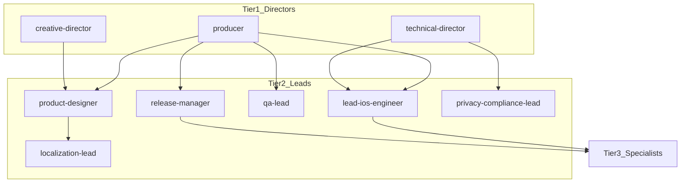

# Agent coordination map

## Delegation (vertical)

## Escalation rules

| Conflict type | Escalate to |
|---------------|-------------|
| Vision vs. scope / deadline | `creative-director` + `producer` |
| Two technical approaches differ materially | `technical-director` |
| Privacy vs. product analytics defaults | `privacy-compliance-lead` → `technical-director` |
| Release readiness disputed | `qa-lead` + `release-manager` → `producer` |
| Localization blocks UI freeze | `localization-lead` → `product-designer` |

## Horizontal consultation

- Specialists may **consult** peers (e.g. `networking-engineer` + `security-engineer`) but **cannot** override another domain’s lead without escalation.
- Cross-cutting changes (navigation, dependency injection container, shared models) go through **`lead-ios-engineer`**.

## File ownership (typical)

| Path | Primary owner |
|------|----------------|
| `ios/**/Views/**`, `*View.swift` | `swiftui-engineer` |
| `*ViewModel.swift` | `swiftui-engineer` + `lead-ios-engineer` |
| `ios/**/Networking/**` | `networking-engineer` |
| `ios/**/Services/**` | `lead-ios-engineer` (with domain specialist) |
| `ios/**/Tests/**` | `test-engineer` |
| `design/**` | `product-designer` |
| `docs/architecture/**` | `technical-director` |
| App Store metadata / ASC | `release-manager` |

Agents should **not** modify files outside their domain without explicit delegation from the relevant lead or director.
